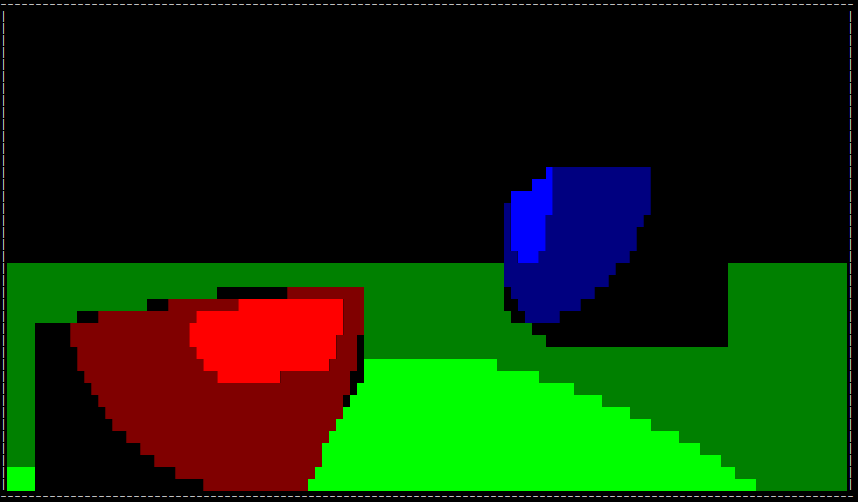
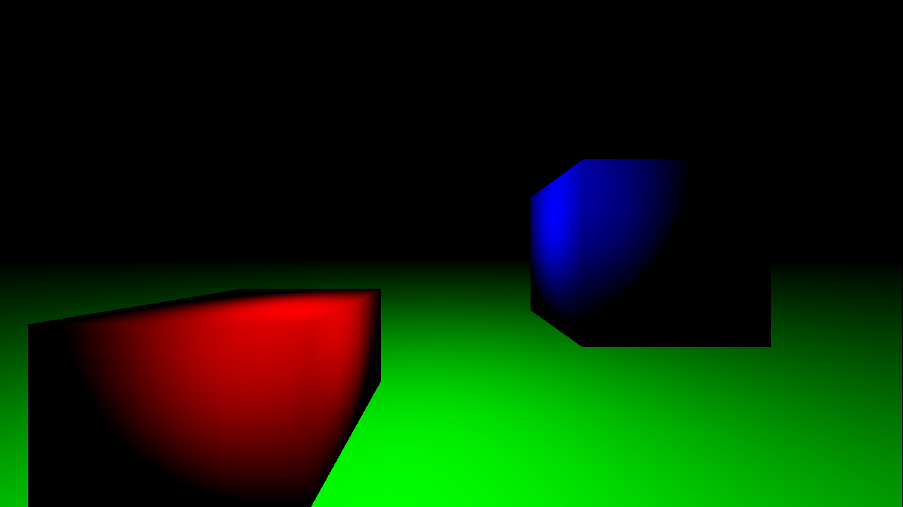

# conrast - Software rasterizer from scratch
Started as a learning project for graphics programming basics, conrast should render simple 3D-Scenes to a Console/Terminal output. Therefore the name *conrast* (**con**sole **rast**erizer).

For each problem I encounter, while extending the renderer, I first try to find a solution on myself before researching common techniques. An experienced rendering engineer will find many issues in the used algorithms and data structures. *conrast* isn't meant for use, but for learning on my side.

# (More or less) up-to-date renderings:

